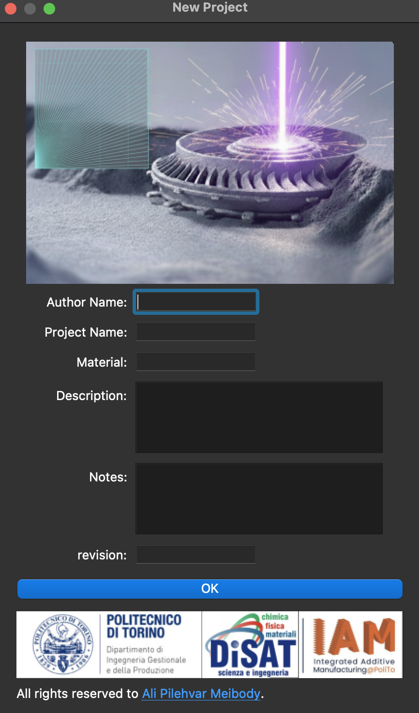
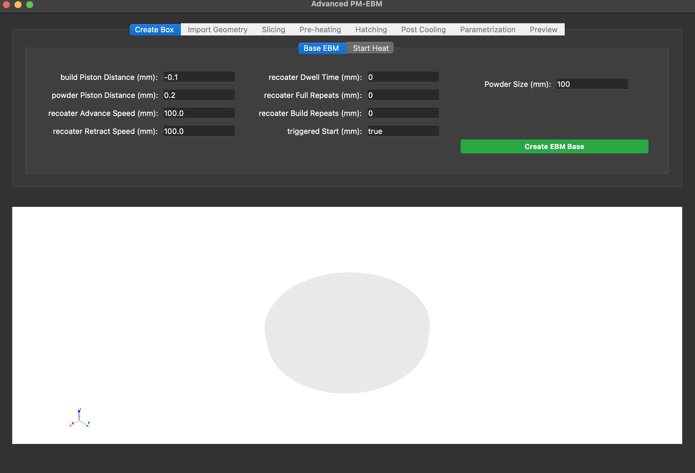
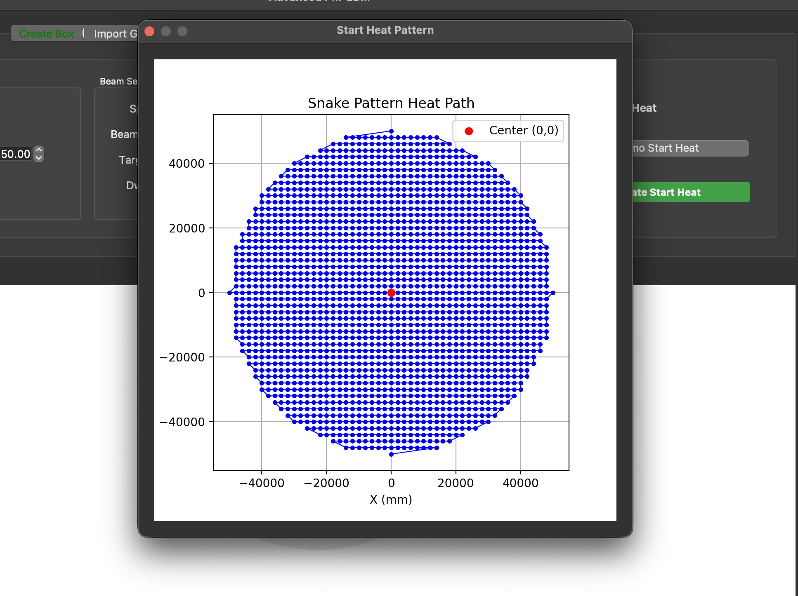
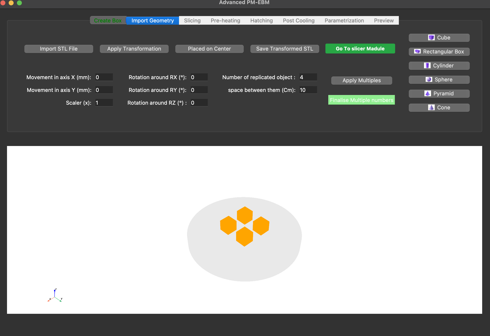
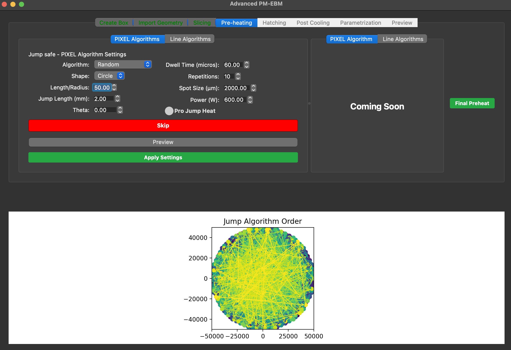
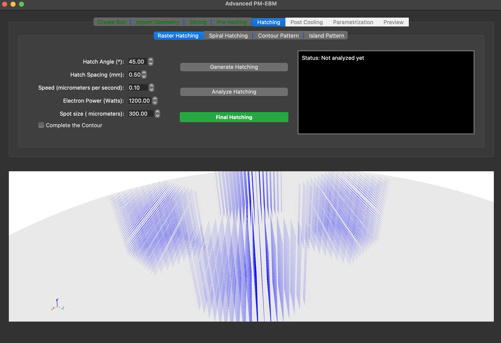
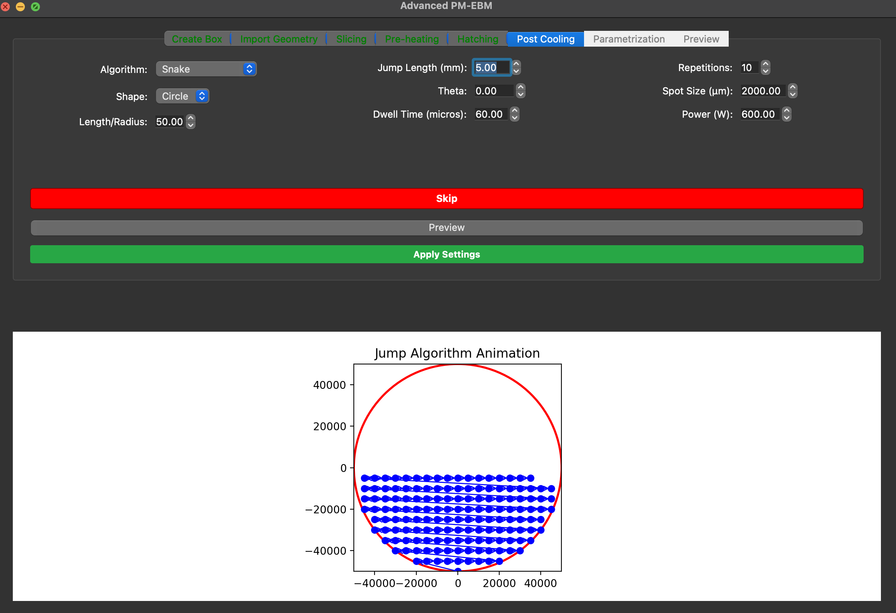
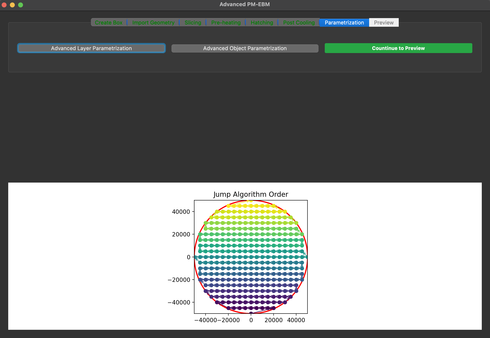
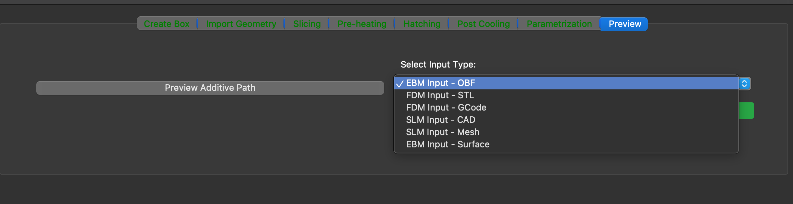

# EBM PathGen GUI

**Electron Beam Melting path generation software** — especially for **Freemelt** machines. This application takes an input STL, slices it, hatches it, and adds preheating and post-cooling so you get a layer-by-layer **OBF** (electron-beam path) file. When you load the `.obf` file into the machine, it can follow the path and perform additive manufacturing.

This project is **authored by Ali Pilehvar Meibody** under the supervision of **Professor Saboori** at **Politecnico di Torino**.

---

## What this software does

- **Input:** STL geometry (or built-in primitives).
- **Workflow:** Slice → preheating (initial heat) → hatching (electron path) → post-cooling → parametrization.
- **Output:** OBF file (currently for Freemelt; other machine formats may be added later).

The workflow is designed so that anyone who needs to go from STL directly into machine-ready paths can do it in one application: slice the part, define preheating and post-cooling patterns, set hatching (angle, spacing, speed, etc.), and export the OBF that the machine uses to build the part.

---

## Application workflow (with screenshots)

Screenshots are in the **`Application_Screens/`** folder. The flow is:

### 1. Create project — `1-Create_page.png`

Before starting, you **create a project**: enter the **author name**, **material**, **notes**, and other metadata, then create the project. This sets the context for the whole build.



---

### 2. Build volume (box) — `2-box_page.png`

The **box** represents the **substrate / build volume** of your experiment. Default dimensions are provided (e.g. from the machine/company); you can **adjust** them as needed for your run.



---

### 3. Initial heat (start heat) — `3-initial_heat.png`

Here you define the **initial heating pattern** (e.g. **snake**), the **radius** of the heated area, and all related **EBM parameters** (beam energy, dwell time, spread algorithm, etc.). This is the preheating of the substrate before the main build.



---

### 4. Geometry — `4-Geometry.png`

On the **Geometry** page you can:

- **Import your STL** file, or  
- Use **built-in primitives** (box, cylinder, sphere, cone, pyramid, etc.).

Then you can **move** the part in X and Y, **scale** it, **rotate** it (RX, RY, RZ), create **multiple copies** with spacing, and **apply transformation**. When you are satisfied, you save the transformed STL and proceed to slicing.



---

### 5. Slicing — `5-slicing.png`

In **Slicing** you choose how to define layer thickness:

- By **number of layers**, or  
- By **layer interval** (height).

You then **Slice** the model, **Analyze** the result (to check that layers and contours are correct), and **Finalize** the slicing. This step is similar in concept to many dedicated slicing tools: it produces the layer contours that will later be hatched.


---

### 6. Preheating (jump-safe) — `6-preheat.png`

**Preheating** (per layer or per region) uses **pixel** or **line** algorithms. You can enable options like **Pro jump**, **preview** the pattern, and then **Apply** the settings. This defines how the beam preheats each layer or region before hatching.



---

### 7. Hatching — `7-hatching.png`

**Hatching** is the **electron path** for the actual melting: you set **angle**, **spacing**, **speed**, and other parameters. You **generate** the hatch, **analyze** it, and **finalize** hatching. This produces the paths that the machine will follow to melt the material layer by layer.



---

### 8. Post-cooling — `8-post_cooling.png`

**Post-cooling** defines the cooling pattern after each layer (or at the end). You configure shape, algorithm, jump length, dwell time, etc., and apply it. This completes the thermal strategy for the build.



---

### 9. Advanced settings — `9-advanced.png`

**Advanced** options (e.g. layer- or object-level parametrization) are available here. Further extensions are planned for future versions.



---

### 10. Output — `10-Output_files.png`

Finally, you get the **output files**. At present the software produces **OBF** (and related) files for **Freemelt** machines. Loading the `.obf` into the machine allows it to run the generated path and perform additive manufacturing. Support for other machine formats may be added in the future.



---

## Quick start (after clone)

Create or activate your own Python environment, then:

```bash
git clone <repo-url> EBMPathGen-GUI && cd EBMPathGen-GUI
./pm_ebm install    # install dependencies into current env
./pm_ebm run        # start the app
```

The **`pm_ebm`** CLI does not create environments; use your own (conda, venv, or system).  
- `./pm_ebm install` — runs `pip install -r requirements.txt`  
- `./pm_ebm run` — starts the application  
- `./pm_ebm` or `./pm_ebm ls` — list commands  

---

## Requirements

- **Git** (to clone the repository)
- **Python 3.8+** (3.10–3.12 recommended)
- Your own environment (conda, venv, or system Python)

---

## Setup and run

### Option A — Using `pm_ebm`

From the project root (with your environment active):

```bash
./pm_ebm install    # one-time: install deps
./pm_ebm run        # start the app
```

Or use the scripts: `./scripts/setup_and_run.sh` (install + run), `./scripts/run.sh` (run only).

### Option B — Manual

1. Create and activate your environment.
2. From the project root: `pip install -r requirements.txt`
3. Run: `python main.py`

**Windows:** The scripts are for macOS/Linux. On Windows, use Option B: create a conda/venv, then `pip install -r requirements.txt` and `python main.py`.

---

## Project layout

| Path | Description |
|------|--------------|
| `main.py` | Application entry point |
| `pm_ebm` | CLI: `install`, `run`, `ls` (no env creation) |
| `requirements.txt` | Python dependencies |
| `scripts/` | `setup_and_run.sh`, `run.sh`, `setup.sh` |
| `ebm_pathgen_gui/` | GUI (dialogs, main window, advanced windows) |
| `PM_EBM_CORE/` | Core logic (mesh, heat, OBF generation) |
| `Application_Screens/` | Screenshots (1–10) for each workflow step |
| `default_obps/` | Default OBP files used by the app |

---

## Troubleshooting

- **Scripts or `pm_ebm` not executable:**  
  `chmod +x pm_ebm scripts/*.sh`
- **Use `pm_ebm` from anywhere:**  
  From project root run once: `./pm_ebm link`
- **Wrong Python or missing packages:**  
  Activate the same environment where you ran `./pm_ebm install` (or `pip install -r requirements.txt`) before `./pm_ebm run`.
